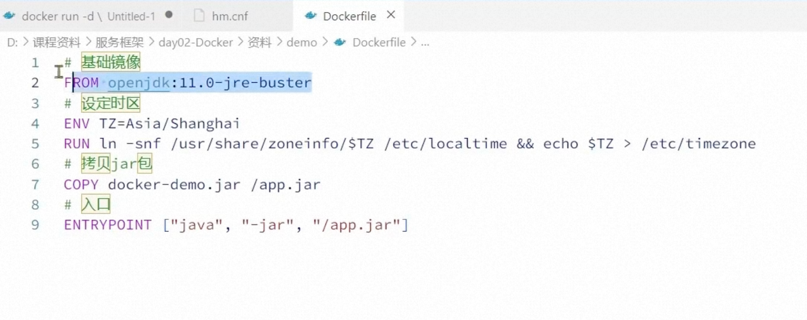
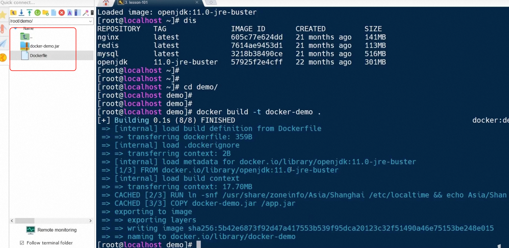

## 一: 数据卷/目录挂载

作用: 可以把容器内的资源目录挂载到宿主机上，方便数据的持久化和共享。比如nginx的配置文件、日志文件等。

用法: 在创建容器的时候使用-v指定 docker run -d --name nginx -v html:/usr/share/nginx/html -p 8080:80 nginx

html是数据卷的名字后面是容器目录 如果是苹果电脑Docker 跑在 Colima 的 Linux 虚拟机里那么数据卷会存在虚拟机里面如果想要保存在本机使用如下命令 

docker run -d --name nginx -v /home/html:/usr/share/nginx/html -p 8080:80 nginx,数据卷会保存在本机/home/html目录下

mysql数据目录挂载,防止数据丢失
docker run -d --name mysql1 -p 3307:3306 -e TZ=Asia/Shanghai -e MYSQL_ROOT_PASSWORD=123 -v /root/mysql/data:/var/lib/mysql mysql

## Dockerfile 打包自己的nginx镜像

项目开发好了之后如果想要使用docker 部署的话想要打包成docker镜像, 步骤: 编写Dockerfile文件, 项目代码打包成jar包
然后使用docker build命令打包成镜像, 最后使用docker run命令运行容器。

文件的内容如下, 想要使用opjdk的基础镜像,需要吧相应的包下载下来使用docker load -i 把它导入到本地

使用docker build -t demo . 命令打包成镜像, .表示打包的项目jar包在当前目录下, -t指定镜像的名字和版本号

## 网络

docker启动的容器如果想要实现通信需要在一个网络
docker network create wbw 创建一个叫做wbw的网络
docker network connect wbw mysql    docker network connect wbw mysql 把mysql和redis加入到网络中
这样msyql和redis就可以互相通信了

