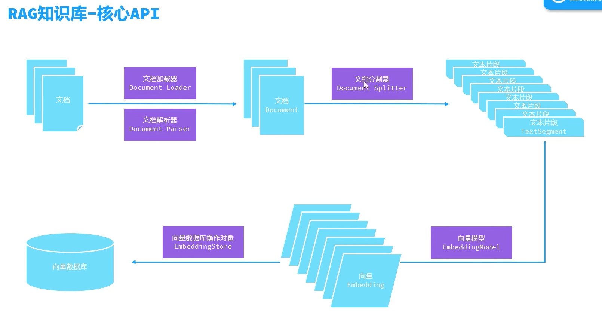
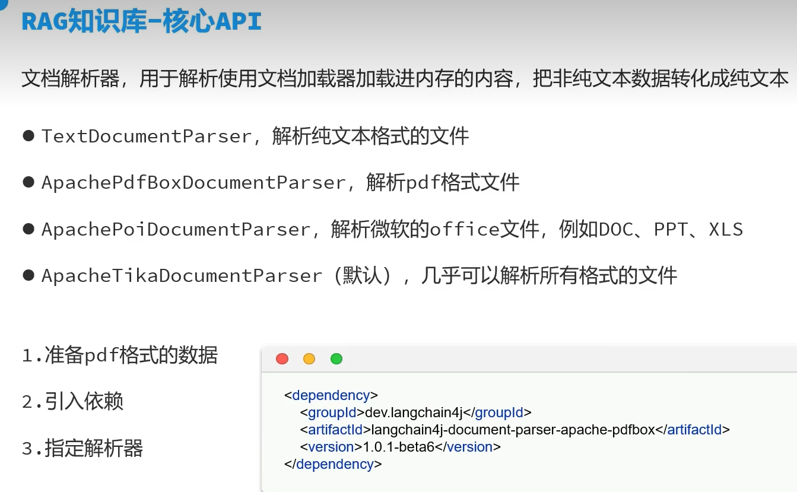

# 一: 会话

## 1.1 快速入门
   使用langchain4j开发大模型主要分成三步 

   a. pom引入依赖
```
   <dependency>
   <groupId>dev.langchain4j</groupId>
   <artifactId>langchain4j-open-ai</artifactId>
   <version>1.0.1</version>
   </dependency>
```

   b. 创建会话
```java
   OpenAiChatModel model = OpenAiChatModel.builder()
   .baseUrl("http://localhost:11434/v1")
   .apiKey("ollama")                       // Ollama 不校验，但别留空字符串
   .modelName("qwen3:0.6b")
   .temperature(0.7)
   .timeout(Duration.ofSeconds(120))       // 本地 CPU 推理慢，默认 60s 容易超时
   .logRequests(true)
   .logResponses(true)
   .build();
 ```

   c. 调用
```java
        String chat1 = model.chat("你好，用一句话介绍你自己");
        System.out.println(chat1);
 ```

## 1.2 整合spring
使用springboot整合langchain4j开发大模型主要分成三步

a. pom引入依赖
```
        <dependency>
            <groupId>dev.langchain4j</groupId>
            <artifactId>langchain4j-open-ai-spring-boot-starter</artifactId>
            <version>1.0.1-beta6</version>
        </dependency>

```

b. 配置
```java
   langchain4j:
        open-ai:
        chat-model:
        base-url: http://localhost:11434/v1
        api-key: ollama
        model-name: qwen3:0.6b
        temperature: 0.7
        log-requests: true
        log-responses: true
 ```

c. 调用
```java
    @Autowired
private OpenAiChatModel model;

@GetMapping("/chat/{message}")
public String equals(@PathVariable String message) {
    String res = model.chat(message);
    return res;
}
 ```


## 1.3 使用AiServices工具类
 
  AiServices工具类封装了常用的调用方法，使用起来更方便 
 a. pom引入依赖
```
    <dependency>
            <groupId>dev.langchain4j</groupId>
            <artifactId>langchain4j-spring-boot-starter</artifactId>
            <version>1.0.1-beta6</version>
        </dependency>
 ```
    
    b. 声明
```java
        @AiService
        public interface ConsultantService {
            public String chat(String message);
          }
```
   c. 调用
```java
    @Autowired
    private ConsultantService consultantService;

    @GetMapping("/chat-ai/{message}")
    public String chatAi(@PathVariable String message) {
        String r = consultantService.chat(message);
        return r;
    }


```

## 1.4 流式调用


a. pom引入依赖
```
        <dependency>
            <groupId>org.springframework.boot</groupId>
            <artifactId>spring-boot-starter-webflux</artifactId>
        </dependency>

        <dependency>
            <groupId>dev.langchain4j</groupId>
            <artifactId>langchain4j-reactor</artifactId>
            <version>1.0.1-beta6</version>
        </dependency>

 ```

    b. 声明
```java
@AiService(
        wiringMode = AiServiceWiringMode.EXPLICIT,
        streamingChatModel = "openAiStreamingChatModel"
)
public interface ConsultantService {


 Flux<String> chat(String message);

}

```
c. 调用
```java

@GetMapping(value = "/chat-ai/{message}",produces = "text/html;charset=utf-8") 
public Flux<String> chatAi(@PathVariable String message) {     
    Flux<String> r = consultantService.chat(message);
    return r;
}

```


## 1.5 消息注解

@SystemMessage() 指定系统消息可以直接写也可以指定文字
@UserMessage() 用户消息如果指定变量需要使用{{it}}占位符,如果想要使用其他变量需要使用@V('')注解指定
```java
//    @SystemMessage("你是一个十年程序员擅长Java+Python开发")
@SystemMessage(fromResource = "system.txt")
//    @UserMessage("五句话回复,{{it}}")
@UserMessage("回复之前加一句月月说,{{msg}}")
Flux<String> chat(@V("msg") String message);

```

## 1.6 会话记忆隔离

```java
@Bean
public ChatMemoryProvider wbwChatMemoryProvider(){
 ChatMemoryProvider chatMemoryProvider = new ChatMemoryProvider() {
  @Override
  public ChatMemory get(Object memberId) {
   return MessageWindowChatMemory.builder()
           .id(memberId)
           .maxMessages(100)
           .build();
  }
 };

 return chatMemoryProvider;
}


@AiService(
        wiringMode = AiServiceWiringMode.EXPLICIT,
        streamingChatModel = "openAiStreamingChatModel",
//        chatMemory = "wbwChatMemory"
        chatMemoryProvider = "wbwChatMemoryProvider"
)
```
 调用, 每次生成一个新的memoryId, 记忆隔离
```java

@SystemMessage(fromResource = "system.txt")
@UserMessage("{{msg}}")
Flux<String> chat(@MemoryId String memoryId, @V("msg") String message);


@GetMapping(value = "/chat",produces = "text/html;charset=utf-8")
public Flux<String> chatAi(
        @MemoryId String memoryId,
        @RequestParam @UserMessage String message) {
 Flux<String> r = consultantService.chat(message);
 return r;
}


```

## 1.7 会话记忆持久化
```
    <dependency>
        <groupId>org.springframework.boot</groupId>
        <artifactId>spring-boot-starter-data-redis</artifactId>
    </dependency>
```

```java
@Component
public class RedisStorage implements ChatMemoryStore {

    @Autowired
    private StringRedisTemplate redisTemplate;

    @Override
    public List<ChatMessage> getMessages(Object memoryId) {

        String json = redisTemplate.opsForValue().get(memoryId.toString());
        List<ChatMessage> chatMessageList = ChatMessageDeserializer.messagesFromJson(json);

        return chatMessageList;
    }

    @Override
    public void updateMessages(Object memoryId, List<ChatMessage> list) {

        String json = ChatMessageSerializer.messagesToJson(list);
        redisTemplate.opsForValue().set(memoryId.toString(), json, Duration.ofDays(1));
    }

    @Override
    public void deleteMessages(Object memoryId) {
        redisTemplate.delete(memoryId.toString());
    }
}


@Bean
public ChatMemoryProvider wbwChatMemoryProvider(){
 ChatMemoryProvider chatMemoryProvider = new ChatMemoryProvider() {
  @Override
  public ChatMemory get(Object memberId) {
   return MessageWindowChatMemory.builder()
           .id(memberId)
           .chatMemoryStore(redisStorage)
           .maxMessages(100)
           .build();
  }
 };

 return chatMemoryProvider;
}

```


# 二：RAG
## 2.1 快速入门
引入依赖

```java

      <dependency>
            <groupId>dev.langchain4j</groupId>
            <artifactId>langchain4j-easy-rag</artifactId>
            <version>1.0.1-beta6</version>
        </dependency>

```

配置存储对象

```java
    @Bean
    public EmbeddingStore store(){
    // 1.加载内存文档
    List<Document> documents = ClassPathDocumentLoader.loadDocuments("content");
    // 2.构建向量数据库操作对象
    InMemoryEmbeddingStore<TextSegment> store = new InMemoryEmbeddingStore<>();
    // 完成文本切割向量化
    EmbeddingStoreIngestor ingestor = EmbeddingStoreIngestor.builder()
    .embeddingStore(store)
    .build();
    ingestor.ingest(documents);
    return store;
    }

    // 构建向量数据库对象
    @Bean
    public ContentRetriever contentRetriever(EmbeddingStore<TextSegment> store){
        return EmbeddingStoreContentRetriever.builder()
                .embeddingStore(store)
                .minScore(0.5)
                .maxResults(3)
                .build();
    }

增加声明

    @AiService(
    wiringMode = AiServiceWiringMode.EXPLICIT,
    streamingChatModel = "openAiStreamingChatModel",
    chatMemoryProvider = "wbwChatMemoryProvider",
    contentRetriever = "contentRetriever"
    )
    public interface ConsultantService {
    @SystemMessage(fromResource = "system.txt")
    @UserMessage("{{msg}}")
    Flux<String> chat(@MemoryId String memoryId, @V("msg") String message);
    }
```

## 2.2 常用分词器
 
文档解析器
TextDocumentParser 读取文本文件, 
ApachePdfBoxDocumentParser 读取pdf文件,
ApachePoiDocumentParser 读取微软office文件,例如docx,xlsx,pptx等,
ApacheTikaDocumentParser 读取多种格式文件


分词器 DocumentSplitter 
DocumentByParagraphSplitter 按段落分词器,可以指定分词长度和重叠长度
DocumentBySentenceSplitter 按句子分词器,可以指定分词长度和重叠长度
DocumentByLineSplitter 按行分词器,可以指定分词长度和重叠长度
DocumentByWordSplitter 按单词分词器,可以指定分词长度和重
DocumentSplitters.recursive(500, 100) 递归分词器,可以指定分词长度和重叠长度






```java

    @Bean
    public EmbeddingStore store(){
        // 1.加载内存文档,使用读取pdf专用的类读取
        List<Document> documents = ClassPathDocumentLoader.loadDocuments("content",new ApachePdfBoxDocumentParser());
        // 2.构建向量数据库操作对象
        InMemoryEmbeddingStore<TextSegment> store = new InMemoryEmbeddingStore<>();
        // 3.构建分词器
        DocumentSplitter ds = DocumentSplitters.recursive(500, 100);

        // 完成文本切割向量化
        EmbeddingStoreIngestor ingestor = EmbeddingStoreIngestor.builder()
                .embeddingStore(store)
                .documentSplitter(ds)
                .build();
        ingestor.ingest(documents);
        return store;
    }
```

设置把文本片段向量化

```java

    embedding-model:
    base-url: https://ws-wv7h0m185gfo9l9o.cn-beijing.maas.aliyuncs.com/compatible-mode/v1
    api-key: sk-ws-H.PMPLELM.4SZm.MEQCICrWkumM7FKYq2PGINGBPaoFh3N5HGpkinxO_MG2ZQO7AiBx0QhPBuhs3PDy2wEMOeDZBiInFuUVTM0na2JDDaQgVQ
    model-name: qwen3.7-text-embedding
    log-requests: true
    log-responses: true

```


向量存储， 使用redsi

引入依赖

```java

    <dependency>
    <groupId>dev.langchain4j</groupId>
    <artifactId>langchain4j-community-redis-spring-boot-starter</artifactId>
    <version>1.0.1-beta6</version>
    </dependency>

配置

    langchain4j:
    # 配置rag存储
      community:
        redis:
        host: localhost
        port: 6379

    # 设置发送最大文档数
    embedding-model:
        base-url: https://ws-wv7h0m185gfo9l9o.cn-beijing.maas.aliyuncs.com/compatible-mode/v1
        api-key: sk-ws-H.PMPLELM.4SZm.MEQCICrWkumM7FKYq2PGINGBPaoFh3N5HGpkinxO_MG2ZQO7AiBx0QhPBuhs3PDy2wEMOeDZBiInFuUVTM0na2JDDaQgVQ
        model-name: qwen3.7-text-embedding
        log-requests: true
        log-responses: true
        max-segments-per-batch: 10 # 每次发给大模型最多10个文档

    
    @Bean
    public EmbeddingStore store(){
        // 1.加载内存文档,使用读取pdf专用的类读取
        List<Document> documents = ClassPathDocumentLoader.loadDocuments("content",new ApachePdfBoxDocumentParser());
        // 2.构建向量数据库操作对象(内存存储)
        //InMemoryEmbeddingStore<TextSegment> store = new InMemoryEmbeddingStore<>();
        // 3.构建分词器
        DocumentSplitter ds = DocumentSplitters.recursive(500, 100);

        // 完成文本切割向量化
        EmbeddingStoreIngestor ingestor = EmbeddingStoreIngestor.builder()
    //                .embeddingStore(store)内存存储
    .embeddingStore(redisEmbeddingStore)
    .documentSplitter(ds)
    .embeddingModel(embeddingModel)// 把文本片段向量化
    .build();
    ingestor.ingest(documents);
    return redisEmbeddingStore;
    }

    // 构建向量数据库对象
    @Bean
    public ContentRetriever contentRetriever(/*EmbeddingStore<TextSegment> store*/){
        return EmbeddingStoreContentRetriever.builder()
    //                .embeddingStore(store) 内存存储
    .embeddingStore(redisEmbeddingStore)
    .embeddingModel(embeddingModel)
    .minScore(0.5)
    .maxResults(3)
    .build();
    }
```


# 三 tools

```java
 @Tool("高考志愿填报一对一沟通预约下单，仅当考生完整提供姓名、性别、手机号、预约沟通时间、省份、预估分数时才调用")
 public String bookReservation(
 @P("考生姓名") String name,
 @P("考生性别") String gender,
 @P("考生手机号") String phone,
 @P("考生预约沟通时间，格式 yyyy-MM-dd HH:mm") String communicationTime,
 @P("考生所在省份") String province,
 @P("考生预估分数") int estimatedScore) {
 
         Reservation reservation = new Reservation();
         reservation.setName(name);
         reservation.setGender(gender);
         reservation.setPhone(phone);
         reservation.setCommunicationTime(parseTime(communicationTime));
         reservation.setProvince(province);
         reservation.setEstimatedScore(estimatedScore);
         reservationService.save(reservation);
 
         return "预约成功，预约ID：" + reservation.getId();
     }
```


